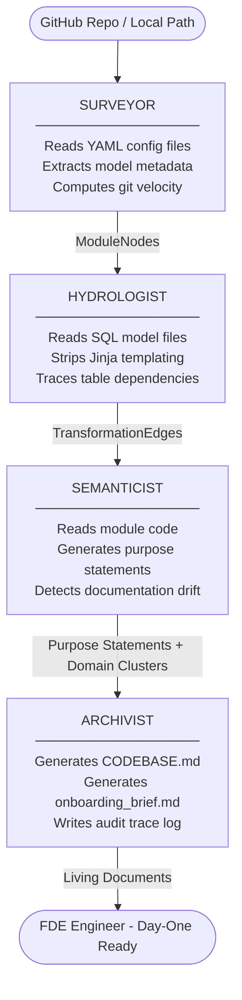

# Brownfield Cartographer — Four Agent Pipeline

## Architecture Diagram

## How Data Flows Through the Pipeline

The pipeline begins when the user points the tool at a GitHub repository
or local folder. The Surveyor reads all YAML configuration files first,
extracting model names, column descriptions, and git change velocity —
building the structural skeleton of the system as ModuleNodes.

The Hydrologist then takes those ModuleNodes and goes deeper, reading
every SQL file, stripping dbt Jinja templating, filtering CTE aliases,
and tracing the real physical table dependencies — producing
TransformationEdges that form the data lineage graph.

The Semanticist uses an LLM to read each module's actual code (not its
docstring) and generate a plain English purpose statement, flagging any
cases where the documentation contradicts the implementation.

Finally the Archivist packages everything into human-readable documents —
a CODEBASE.md living context file, an onboarding brief answering the
five FDE Day-One questions, and a full audit trace log.
