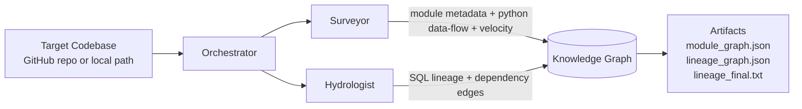
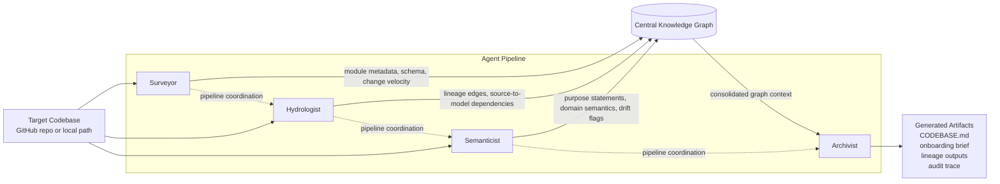

# Brownfield Cartographer Architecture

## Current Architecture (Implemented)

## Planned Architecture (Final Vision)

## Notes

- Implemented today: `Surveyor`, `Hydrologist`, and `Orchestrator`.
- Planned for final phase: `Semanticist` and `Archivist` (plus query/navigation layer).
- This split avoids mixing shipped architecture with roadmap architecture.
