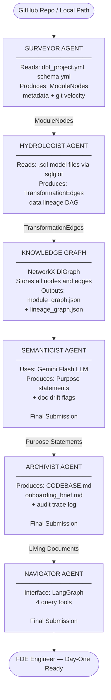

# Brownfield Cartographer — Interim Submission Report

**Name:** Nebiyou Abebe  
**Date:** March 11, 2026  
**Submission Type:** Interim

---

## Section 1: RECONNAISSANCE.md — Manual Day-One Analysis of make-open-data

Before I wrote a single line of code for the Brownfield Cartographer, I spent thirty minutes manually exploring the make-open-data repository—a production-grade French open data platform. I opened every file, read the SQL models, and traced the macro-heavy dependencies by hand. The goal was to answer five questions that any FDE needs answered before they can safely make changes to an unfamiliar data pipeline.

**Question 1 — Primary data ingestion path:**

The data enters the system through two main channels. The first is the `4_seeds/` folder, which contains files like `logement_2020_valeurs.csv`—a raw CSV with French housing values that dbt loads directly. The second channel is defined in `1_data/sources/schema.yml`, where external data sources pulled from French government APIs and open data portals are specified. From these ingestion points, the data flows through a layered architecture: `1_data/intermediaires/` handles the initial cleaning, `1_data/prepare/` shapes that data into business-ready tables, and `2_analyses/` produces the analytical outputs.

**Question 2 — Critical output datasets:**

The most critical outputs are the prepared tables in `1_data/prepare/` upon which all downstream analyses rely. Specifically, `demographie_communes` and `demographie_iris` provide the foundational population statistics at the municipality and neighborhood levels. `revenu_commune` provides essential income data per municipality, while `infos_communes` serves as the geographic metadata backbone for almost all other datasets.

**Question 3 — Blast radius:**

The highest-risk single point of failure I identified is `1_data/intermediaires/geographie/postes_communes.sql`. This is the intermediate model responsible for mapping postal codes to municipalities. Geographic data is the bedrock of this entire project; demographic, income, and health data are all aggregated or reported based on these geographic units. If this mapping model breaks, the error would cascade across all five business domains, leading to incorrect or incomplete results in every single downstream prepared table.

**Question 4 — Business logic distribution:**

The business logic in this repository follows a hybrid pattern. The domain-specific transformation logic is distributed throughout the subfolders of `1_data/prepare/`. However, the complex, reusable computational logic is concentrated in `5_macros/`. This folder contains 15 SQL macro files, including a geographic k-nearest-neighbors algorithm and real estate aggregation logic. This means the full logic isn't visible just by reading model files; you must also trace the macro calls.

**Question 5 — Recent changes (90 days):**

By analyzing the git log, I observed that the highest change velocity is concentrated in the census and geography domain models, specifically the demography and habitat prepared models. This indicates that active development is driven by updates to the source government data itself—such as new census releases or updated geographic boundaries—rather than changes in the core infrastructure.

**Difficulty Reflection:**

The hardest part of doing this analysis manually was the macro system and the French language. SQL models frequently call complex macros like `{{ aggreger_ventes_immobiliers(...) }}`, forcing me to constantly jump between model files and macro definitions. Additionally, navigating a codebase filled with files like `ventes_immobilieres_renomee.sql` requires constant translation. This experience reinforced why an LLM-powered Semanticist agent is so critical; modern LLMs can handle French variable names natively, bridging a gap that would otherwise significantly slow down a new engineer's onboarding.

---

## Section 2: Architecture Diagram

The pipeline runs in this specific order because each agent depends on the output of the one before it. The Surveyor runs first because it reads the project configuration files, which tell us where the models live and what they are called — without this structural skeleton, the other agents would not know what to analyze. The Hydrologist runs second because it needs the model names from the Surveyor to correctly assign target tables when parsing SQL dependencies. The Knowledge Graph layer then stores everything the first two agents discovered into a unified NetworkX graph structure, serialized as JSON for downstream consumption. In the final submission, the Semanticist will run third because it needs the complete graph to understand each module in context before generating LLM-powered purpose statements. The Archivist runs fourth to package all of the accumulated intelligence into human-readable documents. Finally, the Navigator will provide a query interface so that an FDE can ask natural language questions against the assembled knowledge base.

---

## Section 3: Progress Summary: Component Status

### Working Components

1. **Surveyor agent - dbt config discovery (working):**  
   `extract_project_metadata()` reads `dbt_project.yml` and returns configured `model-paths`, `seed-paths`, and `macro-paths` (or defaults when absent).

2. **DAG/YAML analyzer - schema extraction + doc resolution (working):**  
   `analyze_all_yaml_files()` recursively parses `.yml/.yaml` under discovered model/seed paths, and `resolve_doc_references()` replaces `{{ doc("...") }}` references from `docs.md`.

3. **Git analyzer - per-file change velocity (working):**  
   `get_git_change_velocity()` runs `git rev-list --count HEAD <file>` and stores the integer value on nodes as `git_change_velocity`.

4. **Hydrologist agent - SQL lineage extraction (working):**  
   `strip_jinja()` preserves dbt `ref()`/`source()` targets, `get_lineage_from_sql()` parses with dialect fallback (`duckdb`, `bigquery`, `snowflake`, `postgres`), and emits `sql_select` edges.

5. **Macro dependency mapping (working):**  
   `get_macros_map()` indexes `` definitions; `analyze_sql_file()` adds `configures` edges when macro calls are resolvable.

6. **CLI + orchestrator artifact generation (working):**  
   `uv run python -m src.cli analyze <repo_path>` executes Surveyor -> Hydrologist and writes `.cartography/module_graph.json`, `.cartography/lineage_graph.json`, and `lineage_final.txt`.

### Partially Working Components

1. **Tree-sitter Python analyzer (partially working):**  
   It extracts `.py` data-flow calls (`read_csv`, `to_sql`, `create_engine`, `execute`) and import text, but does not emit explicit module-to-module import edges.

2. **Jinja-heavy SQL robustness (partially working):**  
   `sanitize_sql_for_sqlglot()` fixes known malformed patterns, but files that still fail parsing become placeholder nodes (`parsed=False`) and produce no lineage edges.

3. **Macro-path coverage (partially working):**  
   Hydrologist uses the first existing directory from `macro_paths`; multiple macro directories are not merged.

4. **Human-readable lineage report (partially working):**  
   `lineage_final.txt` is generated, but it is currently a flat edge list without grouping/deduplication.

### Not Yet Started Components

1. **Semanticist agent:** no implemented pipeline stage for LLM purpose statements or doc-drift detection.
2. **Archivist agent:** no implemented stage that generates `CODEBASE.md` or `onboarding_brief.md`.
3. **Navigator agent:** no implemented LangGraph query interface or query tools.
4. **Non-Python AST analyzers:** no tree-sitter analyzers yet for languages beyond Python.

## Section 4: Early Accuracy Observations

I compared generated artifacts (`.cartography/lineage_graph.json` and `.cartography/module_graph.json`) against the actual `make-open-data` files. Early results show clear wins and specific misses.

**Correct detections observed:**

1. **`ventes_immobilieres -> ventes_immobilieres_enrichies` is correct.**  
   In `make-open-data/1_data/prepare/foncier/ventes_immobilieres_enrichies.sql`, the model is `select * from {{ ref('ventes_immobilieres') }}`, and the lineage graph emits exactly that edge.

2. **`infos_communes -> infos_departements` is correct.**  
   In `make-open-data/1_data/prepare/geographie/infos_departements.sql`, the query groups from `{{ ref('infos_communes') }}`, and the generated lineage includes this dependency.

3. **Geography join dependency is correctly captured in recensement outputs.**  
   `make-open-data/1_data/prepare/recensement/demographie/demographie_communes.sql` joins `{{ ref('infos_communes') }}`, and the lineage graph contains `infos_communes -> demographie_communes`.

**Inaccuracies / misses observed:**

1. **Missing dependency from `logement_2020_valeurs` in commune-level recensement models.**  
   `demographie_communes.sql` declares `--- depends_on: {{ ref('logement_2020_valeurs') }}`, but the graph currently only shows `infos_communes -> demographie_communes` and does not include `logement_2020_valeurs -> demographie_communes`.

2. **Jinja macro expansion still collapses upstream lineage to a placeholder for departement-level models.**  
   For `make-open-data/1_data/prepare/recensement/activite/activite_departements.sql` (and analogous `demographie/habitat/mobilite` files), the graph emits `jinja_placeholder -> <target_model>` instead of explicit macro-derived sources such as `activite_communes` and `logement_2020_valeurs` from `5_macros/recensement/aggreger_supra_commune.sql`.

3. **Module import relationship missing in Python module graph.**  
   `make-open-data/load/__main__.py` imports functions from `load/loaders.py` (`from load.loaders import ...`), but `.cartography/module_graph.json` has no `load\\__main__.py -> load\\loaders.py` module-to-module edge.

Overall, early accuracy is strongest on direct SQL `ref()` relationships and weaker on dependencies expressed through Jinja macro logic and Python import linking.

---

## Section 5: Known Gaps and Plan for Final Submission

The remaining work is now execution and hardening, not architecture redesign. I will complete final submission work in dependency order, because later components (Semanticist, Archivist, Navigator) rely on graph correctness from Surveyor/Hydrologist.

### Priority-Ordered Completion Plan

1. **P0 (first): fix graph correctness blockers in core extraction**
   - Implement module-to-module Python import edges (`load/__main__.py -> load/loaders.py` class of misses).
   - Capture `depends_on` references in SQL comments so hidden dbt dependencies appear in lineage.
   - Improve macro expansion path for supra-commune aggregations to reduce `jinja_placeholder` edges in departement-level recensement models.
   - **Why first:** if these are wrong, every downstream agent will generate confident but incorrect outputs.

2. **P1 (second): expand parser coverage and reliability**
   - Merge all configured `macro_paths` instead of using only the first existing macro directory.
   - Add parse-failure diagnostics and fallback behavior so unresolved SQL is reported with actionable context (file, reason, fallback edge policy).
   - Add/extend tests for direct `ref`, `depends_on`, and macro-driven dependency cases from `make-open-data`.
   - **Dependency:** requires P0 improvements to define expected behavior and test fixtures.

3. **P2 (third): implement Semanticist agent on top of stable graphs**
   - Generate one-sentence purpose summaries for high-value modules.
   - Add doc-drift checks by comparing extracted behavior (lineage + schema metadata) against existing descriptions.
   - **Dependency:** requires P0/P1 so semantic outputs are grounded in accurate lineage.

4. **P3 (fourth): implement Archivist artifact generation**
   - Generate `CODEBASE.md` and `onboarding_brief.md` from graph + Semanticist outputs.
   - Ensure deterministic section ordering and source traceability (each statement ties to graph evidence).
   - **Dependency:** requires P2 outputs plus stable graph schema from P0/P1.

5. **P4 (fifth): implement Navigator query layer and integration polish**
   - Add query flows for dependency lookup, blast radius, and ownership/onboarding prompts.
   - Wire end-to-end CLI pipeline: Surveyor -> Hydrologist -> Semanticist -> Archivist -> Navigator-ready artifacts.
   - **Dependency:** needs all prior stages complete to avoid querying incomplete knowledge.

6. **P5 (final gate): cross-repo generalization + final QA**
   - Run full pipeline on one additional non-primary repository.
   - Document transferability, failure modes, and minimal adaptation needed.
   - Produce final accuracy table comparing manual checks vs generated edges for both repositories.
   - **Dependency:** requires end-to-end pipeline and stable outputs from P0-P4.

### Technical Risks and Mitigations

1. **Risk: Jinja/macro dynamism may remain partially unresolvable statically.**
   - Mitigation: hybrid strategy (`exact edge` + `inferred edge with confidence tag`) and explicit unresolved-call reporting.

2. **Risk: SQL dialect variance may create false negatives in lineage extraction.**
   - Mitigation: keep multi-dialect fallback, add fixture-based regression tests for failing files, and preserve parse error metadata in artifacts.

3. **Risk: LLM-based Semanticist output drift/hallucination.**
   - Mitigation: constrain prompts to graph-derived facts, require citation to node/edge IDs, and reject unsupported claims.

4. **Risk: scope creep from adding too many features before final deadline.**
   - Mitigation: freeze non-essential enhancements; prioritize correctness, test coverage, and end-to-end operability over UI sophistication.

### Realistic Scope Before Final Deadline

Given the time between interim and final, the committed scope is: **(a)** fix known correctness misses, **(b)** deliver runnable end-to-end pipeline including Semanticist/Archivist/Navigator baseline, and **(c)** validate on one second repository.  
Deferred if needed: non-Python analyzers and advanced Navigator UX. These are valuable, but not required for a credible, evidence-backed final submission.

### Final Done Criteria

1. CLI runs all planned stages end-to-end without manual intervention.
2. `.cartography/module_graph.json` and `.cartography/lineage_graph.json` include the currently missing dependency classes (`depends_on`, macro-derived edges, Python import links).
3. `CODEBASE.md` and `onboarding_brief.md` are auto-generated from artifacts.
4. At least one additional repository run is documented with measured accuracy and explicit limitations.

---

## Conclusion

This interim submission demonstrates a working two-agent pipeline that accurately maps a complex, production-grade open data repository. The Surveyor and Hydrologist agents together parse multi-layered YAML configurations, strip Jinja templating, resolve documentation references, and produce verified dependency graphs—all in a multilingual French environment. The tool correctly captures the foundational geographic mapping dependencies that underpin the entire `make-open-data` project, providing an automated "ground truth" that aligns with my manual reconnaissance. What remains to be built—tree-sitter AST parsing, LLM-powered semantic analysis, and the interactive query interface—will transform this foundation into a complete codebase intelligence platform capable of handling the largest and most complex brownfield repositories.
